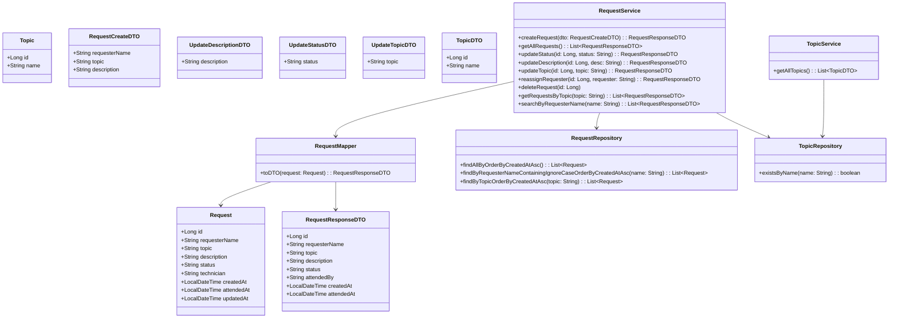

# 🖥️ Digital Academy Help Desk API

API REST para la gestión de **solicitudes (requests)** y **temas (topics)** de soporte, desarrollada con **Spring Boot 3**, **JPA/Hibernate** y **H2 in-memory**. Ideal para fines académicos.

---

## 🛠️ Tecnologías

- Java 21  
- Spring Boot 3  
- Spring Data JPA  
- H2 Database (in-memory)  
- JUnit 5 + Mockito  
- Swagger/OpenAPI  

---

## 📂 Estructura

- **model**: Entidades JPA (`Request`, `Topic`)  
- **dto**: Data Transfer Objects  
- **repository**: Repositorios JPA  
- **service**: Lógica de negocio  
- **mapper**: Conversión entre entidades y DTOs  
- **controller**: Endpoints REST  
- **exception**: Excepciones personalizadas  

## 🚀 Funcionalidades principales

### Requests

| Método | Endpoint | Descripción | Body | Respuesta |
|--------|---------|-------------|------|-----------|
| `GET` | `/api/v1/requests` | Listar todas las solicitudes | - | Lista de `RequestResponseDTO` |
| `POST` | `/api/v1/requests` | Crear una nueva solicitud | `RequestCreateDTO` | `RequestResponseDTO` creado |
| `PATCH` | `/api/v1/requests/{id}/status` | Actualizar estado de una solicitud | `UpdateStatusDTO` | `RequestResponseDTO` actualizado |
| `PATCH` | `/api/v1/requests/{id}/description` | Actualizar descripción de una solicitud | `UpdateDescriptionDTO` | `RequestResponseDTO` actualizado |
| `PATCH` | `/api/v1/requests/{id}/topic` | Cambiar topic de la solicitud | `UpdateTopicDTO` | `RequestResponseDTO` actualizado |
| `PATCH` | `/api/v1/requests/{id}/requester` | Cambiar solicitante de la solicitud | `{ "requesterName": "NuevoNombre" }` | `RequestResponseDTO` actualizado |
| `GET` | `/api/v1/requests/search?requesterName=Alice` | Buscar solicitudes por nombre del solicitante | - | Lista de `RequestResponseDTO` |
| `GET` | `/api/v1/requests/topic/{topicName}` | Obtener solicitudes por topic | - | Lista de `RequestResponseDTO` |
| `DELETE` | `/api/v1/requests/{id}` | Eliminar solicitud | - | 204 No Content |

---

### Topics

| Método | Endpoint | Descripción | Body | Respuesta |
|--------|---------|-------------|------|-----------|
| `GET` | `/api/v1/topics` | Listar todos los topics disponibles | - | Lista de `TopicDTO` |

---

## 🏃‍♂️ Cómo lanzar el proyecto

1. Clonar el repositorio:

```bash
git clone https://github.com/miguelbac/digital_academy_help_desk_API.git
cd digital_academy_help_desk_API
```
Construir con Maven:
```
mvn clean install
```

Ejecutar:
```
mvn spring-boot:run
```

La API corre en: http://localhost:8080

📄 Swagger UI

Documentación y pruebas interactivas:

http://localhost:8080/swagger-ui.html

🗂️ Base de datos H2

URL: jdbc:h2:mem:testdb

Usuario: SA

Contraseña: (vacío)

Consola: http://localhost:8080/h2-console

📝 Diagrama de clases



🧪 Captura de tests


